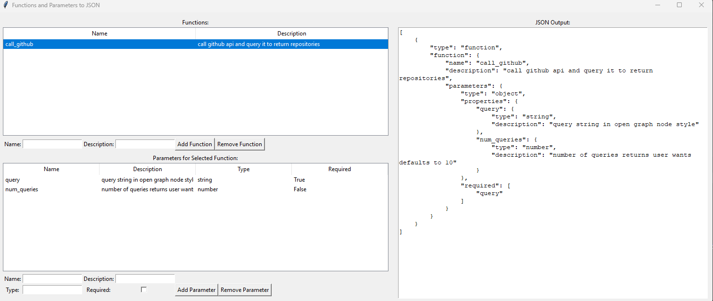
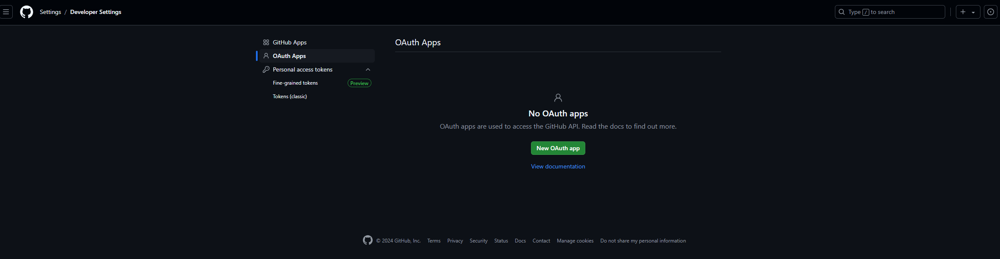

# **GitHub Repository Query Tool Using GPT-4**

This project is a Python-based application that leverages OpenAI’s GPT-4 API and the GitHub GraphQL API to dynamically generate and execute queries based on user input. It allows users to search for repositories that match their descriptions, making it easy to explore specific GitHub projects programmatically.

Users can say what they want to find, or what they are interested in natural language and will be returned with a list of repositories that matches that query.

**Example question:** 
How do I show pretty shaders on the web?


**Example output:**
```
----------------------------------------
Name: infinite-webl-gallery
Owner: bizarro
URL: https://github.com/bizarro/infinite-webl-gallery
Description: Infinite Auto-Scrolling Gallery using WebGL and GLSL Shaders.
----------------------------------------
Name: webgl-fundamentals
Owner: gfxfundamentals
URL: https://github.com/gfxfundamentals/webgl-fundamentals
Description: WebGL lessons that start with the basics
----------------------------------------
Name: webassembly-webgl-shaders
Owner: DanRuta
URL: https://github.com/DanRuta/webassembly-webgl-shaders
Description: Demo project for using WebGL shaders in WebAssembly
----------------------------------------
Name: webgl-workshop
Owner: stackgl
URL: https://github.com/stackgl/webgl-workshop
Description: :mortar_board: The sequel to shader-school: Learn the WebGL API
----------------------------------------
Name: shader-doodle
Owner: halvves
URL: https://github.com/halvves/shader-doodle
Description: A friendly web-component for writing and rendering shaders.
----------------------------------------
Name: webgl-shader-examples
Owner: jagracar
URL: https://github.com/jagracar/webgl-shader-examples
Description: Some simple examples of WebGL shaders
----------------------------------------
Name: jam3-lesson-webgl-shader-threejs
Owner: Experience-Monks
URL: https://github.com/Experience-Monks/jam3-lesson-webgl-shader-threejs
Description: Using custom vertex and fragment shaders in ThreeJS
----------------------------------------
Name: webglstudio.js
Owner: jagenjo
URL: https://github.com/jagenjo/webglstudio.js
Description: A full open source 3D graphics editor in the browser, with scene editor, coding pad, graph editor, virtual file system, and many features more.
----------------------------------------
Name: jam3-lesson-webgl-shader-intro
Owner: Experience-Monks
URL: https://github.com/Experience-Monks/jam3-lesson-webgl-shader-intro
Description: A brief introduction to fragment shaders.
----------------------------------------
```

# **Demo**
<video src="images/demo.mp4" autoplay muted loop playsinline width="100%"></video>
---

## **Features**
- Converts natural language queries into precise GraphQL queries for the GitHub API.
- Automatically fetches repository details, including name, owner, URL, and description.
- Integrates with the Azure OpenAI GPT-4 API for natural language understanding.
- Supports dynamic function calls to streamline GitHub queries and responses.

---

## **Project Folder**
- *images/* - contains images for README
- *libs/* - contains main scripts
    - **bot.py** - main code for the bot that is shown on the demo
    - **chatgpt_query_gui.py** - A small GUI application that helps you form your ChatGPT API function call JSON easily as shown below:
    


## **Setup Instructions**

### **Prerequisites**
1. Python 3.8+ installed on your machine.
2. An Azure OpenAI API key and endpoint.
3. A GitHub Personal Access Token. You can get your Personal Access Token like the picture shown below:
    


### **Installation**
1. Clone the repository:
   ```bash
   git clone https://github.com/proud-p/chatgpt-call-github
   cd chatgpt-call-github
   ```
2. ```pip install -r requirements.txt```
3. Create a .env file in the root director with the following keys:
    ```
    AZURE_KEY=your_azure_openai_key
    AZURE_ENDPOINT=your_azure_openai_endpoint
    GITHUB_TOKEN=your_github_personal_access_token
    ```


